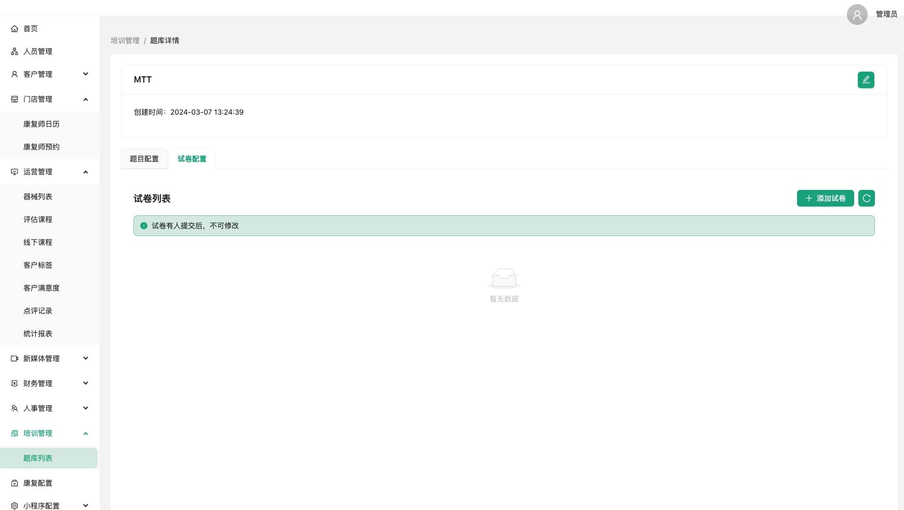

# 题库列表

#### 题库列表

* 可对题库进行编辑、删除操作，以及查看对应的题库详情

<figure><figcaption></figcaption></figure>

#### 添加题库

* 按照如图所示，进入填写添加

<figure><figcaption></figcaption></figure>

#### 题库详情-题目配置

* 查看题库对应的题目列表，添加、编辑、删除对应的题目

<figure><figcaption></figcaption></figure>

* 可添加三种题型：单选题、多选题、简单题

<figure><figcaption></figcaption></figure>

* 添加单选题

<figure><figcaption></figcaption></figure>

* 添加多选题

<figure><figcaption></figcaption></figure>

* 添加简单题

<figure><figcaption></figcaption></figure>

#### 题库详情-试卷配置

* 查看对应的试卷列表，并对试卷进行添加和编辑、删除等操作

<figure><figcaption></figcaption></figure>

* 添加试卷，按照如下所示，填写字段进行添加

<figure><figcaption></figcaption></figure>
